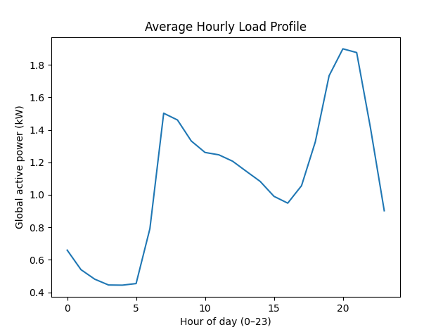

# Energy Data Projects

This repository contains two small Python + Pandas projects focused on cleaning and analyzing energy consumption data.

---

## Project 1: Energy Usage Data Cleaning

**Folder:** `project1_energy_data_cleaning/`

### What it does
- Loads raw household consumption data
- Cleans incorrect and missing values
- Converts the `Date` column into a proper datetime format
- Fills missing Energy and Cost values
- Calculates daily and weekly average energy usage

### Output
- Cleaned dataset printed in the console
- Daily average energy usage
- Weekly average energy usage

---

## Project 2: Building Energy Profile

**Folder:** `project2_building_energy_profile/`

### What it does
- Loads electricity consumption data (minute-level)
- Combines `Date` + `Time` into a `Timestamp`
- Converts energy usage values to numeric
- Resamples data into hourly averages
- Builds an average hourly load profile
- Finds peak demand hours
- Compares weekday vs weekend usage
- Plots the average hourly load profile

### Output
- Top 5 peak hours printed in the console
- Weekday and weekend averages
- Line plot of hourly load profile

## Screenshots

### Project 2: Hourly load profile



---

## Requirements

Install the required libraries:

```bash
pip install pandas matplotlib
